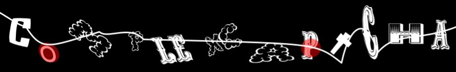

<style>
	span.code {
		display: inline;
		padding: 0;

		width: 100%;

		font-size: 13px;
		font-family: monospace;

		background-color: rgba(0,0,0,0.08);
		color: rgba(0,0,0,0.8);
	}

    table.optstable {
        font-size: 14px;
    }

	table.optstable tr:nth-child(1) td {
		background-color: rgba(0,0,0,0.1);
	}
</style>

<div style="text-align: center">
    <h1>ComplexCaptcha</h1>
    
</div>

---

Project that aims for generating captcha image with various customization options - for Node.JS

---

### Quick look

For simply generating and saving one captcha image:

```ts
import * as fs from "fs";

import ComplexCaptcha from "complexcaptcha";

//

// generating captcha
const data = ComplexCaptcha.Generate({
    mimeType:   "image/jpeg"
});

// saving to file
fs.writeFileSync(`./captcha__${data.solution}.jpeg`), data.buffer);
```

---

### Current features


 - Custom characters list (string)
 - Custom font or fonts selected randomly for each character.
 - Custom colors by creating palette of 3 colors (background, foreground, details) or providing array of palettes (random picking)
 - Displacement of individual characters on y-axis
 - Deformation of individual characters (scaling/skewing)
 - Rotation of individual characters
 - Pairing individual characters for overlaping
 - Randomly picking characters for being impostors (characters that doesn't matter in answer/solution)
 - Randomly picking font for each character.
 - Ability to disable features for individual provided fonts
 - Ability to disable characters for individual provided fonts
 - Drawing fake captcha text in background with smaller font size (dummies)
 - Drawing dirt on top of captcha (currently only lines)

---

### How to build

To build from typescript to javascript CommonJS module, just run command <span class="code">npm run build</span>. You will find built code in <span class="code">dist</span> directory. This command build whole module along with examples.

---

### Examples

To run any of the examples located in examples folder:

1. Run command <span class="code">npm run build</span> for building whole module along with examples.
2. Run command <span class="code">npm run example1</span> for running example1 program.
3. Look at the output in <span class="code">output/example1</span> directory.

---

### API

#### Registering custom font

If You want to use custom font/s, just call <span class="code" lang="ts">ComplexCaptcha.CanvasRegisterFont</span> function with same arguments as in <span class="code" lang="ts">registerFont</span> function in <span class="code">canvas</span> module for Node.js. Read more details here: https://github.com/Automattic/node-canvas#registerfont

#### ComplexCaptcha.Generate

Static function `ComplexCaptcha.Generate` generates captcha and returns object of `GeneratedCaptcha` type. It takes one argument, object of `GenerateOptions` type.

#### GeneratedCaptcha

Object of `GeneratedCaptcha` type contains fields:

<table class="optstable" id="generated-captcha">
    <tr>
        <td>name</td>
        <td>type</td>
        <td>description</td>
    </tr>
	<tr>
		<td>text</td>
		<td><span class="code" lang="ts">string</span></td>
		<td>Contains text that is displayed on generated image. Including impostors, excluding background text/dummies.</td>
	</tr>
	<tr>
		<td>solution</td>
		<td><span class="code" lang="ts">string</span></td>
		<td>Contains text that is answer to generated image. Against that string You want to test answer of user.</td>
	</tr>
	<tr>
		<td>buffer</td>
		<td><span class="code" lang="ts">Buffer</span></td>
		<td>Contains buffer that holds image data in jpeg or png format.</td>
	</tr>
	<tr>
		<td>instructions</td>
		<td><span class="code" lang="ts">Instructions</span></td>
		<td>Contains few informations about generated captcha - useful for composing question that will be presented to user.</td>
	</tr>
</table>

#### GeneratedCaptcha.Instructions

<table class="optstable" id="generated-captcha">
    <tr>
        <td>name</td>
        <td>type</td>
        <td>description</td>
    </tr>
	<tr>
		<td>maxLength</td>
		<td><span class="code" lang="ts">number</span></td>
		<td>Contains text that is displayed on generated image. Including impostors, excluding background text/dummies.</td>
	</tr>
	<tr>
		<td>omitMarked</td>
		<td><span class="code" lang="ts">boolean</span></td>
		<td>Says that impostors/fake characters are on image among real ones and are marked in some way. (currently colored circle)</td>
	</tr>
	<tr>
		<td>omitBackgroundText</td>
		<td><span class="code" lang="ts">boolean</span></td>
		<td>Says that background text units are on image that aren't part of solution/answer.</td>
	</tr>
</table>

#### GenerateOptions

Object of `GenerateOptions` type may contains fields:

<style>
    table#generate-options tr:not(:nth-child(1)) td:nth-child(2) {
        text-align: center;
        font-weight: bold;
    }
    table#generate-options tr:not(:nth-child(1)) td:nth-child(4) {
        max-width: 250px;
    }
</style>

<table class="optstable" id="generate-options">
    <tr>
        <td>name</td>
        <td>optional</td>
        <td>type</td>
        <td>default</td>
        <td>description</td>
    </tr>
	<tr>
		<td>mimeType</td>
		<td></td>
		<td><span class="code" lang="ts">"image/png" | "image/jpeg"</span></td>
		<td><i>N/A</i></td>
		<td>Decides about mime type of image in resulted buffer.</td>
	</tr>
	<tr>
		<td>quality</td>
		<td>✔️</td>
		<td><span class="code" lang="ts">number</span></td>
		<td>0.75</td>
		<td>Decides about quality of image - works only with mimeType of <span class="code" lang="ts">"image/jpeg"</span></td>
	</tr>
	<tr>
		<td>padding</td>
		<td>✔️</td>
		<td><span class="code" lang="ts">number</span></td>
		<td><span class="code" lang="ts">10</span></td>
		<td>Sets padding around captcha for readability.</td>
	</tr>
	<tr>
		<td>characters</td>
		<td>✔️</td>
		<td><span class="code" lang="ts">string</span></td>
		<td><span class="code" lang="ts">"abcdefghijklmonpqrstuvwxyzABCDEFGHIJKLMNOPQRSTUVWXYZ123456790"</span></td>
		<td>List of characters that captcha is built from.</td>
	</tr>
	<tr>
		<td>palette</td>
		<td>✔️</td>
		<td><span class="code" lang="ts">Palette | Palette[]</span></td>
		<td><span class="code" lang="ts">
<pre>{
    background:     [255, 255, 255],
    foreground:     [0, 0, 0],
    details:        [255, 0, 0],
}</pre>
        </span></td>
		<td>Holds colors information, it can be one or array of palettes. With array, generating function will pick one randomly.</td>
	</tr>
	<tr>
		<td>fontSize</td>
		<td>✔️</td>
		<td><span class="code" lang="ts">number</span></td>
		<td><span class="code" lang="ts">60</span></td>
		<td>Size of front characters that build captcha code.</td>
	</tr>
	<tr>
		<td>fontInfo</td>
		<td>✔️</td>
		<td><span class="code" lang="ts">null | FrontFontInfo | FrontFontInfo[]</span></td>
		<td><span class="code" lang="ts">null</span></td>
		<td>Details that describe font usage, or array of them for random picking. See below. Value of <span class="code" lang="ts">null</span> means defaults of <b>Konva</b> library will be used, probably it's about default OS font. Tip: <b>ComplexCaptcha</b> has few fonts preinstalled, free for comercial use.</td>
	</tr>
	<tr>
		<td>length</td>
		<td>✔️</td>
		<td><span class="code" lang="ts">number | [number, number]</span></td>
		<td><span class="code" lang="ts">6</span></td>
		<td>Length of captcha code. It can be number or number range if You want it random.</td>
	</tr>
	<tr>
		<td>charDisplacementV</td>
		<td>✔️</td>
		<td><span class="code" lang="ts">boolean | CharDisplacementVOptions</span></td>
		<td><span class="code" lang="ts">true</span></td>
		<td>Value of <span class="code" lang="ts">true</span> means default inner options will be applied, <span class="code" lang="ts">false</span> means feature is disabled for all fonts and characters. Value of <span class="code" lang="ts">CharDisplacementVOptions</span> type means custom options will be applied - described below.</td>
	</tr>
	<tr>
		<td>charRotation</td>
		<td>✔️</td>
		<td><span class="code" lang="ts">boolean | CharRotationOptions</span></td>
		<td><span class="code" lang="ts">true</span></td>
		<td>Value of <span class="code" lang="ts">true</span> means default inner options will be applied, <span class="code" lang="ts">false</span> means feature is disabled for all fonts and characters. Value of <span class="code" lang="ts">CharRotationOptions</span> type means custom options will be applied - described below.</td>
	</tr>
	<tr>
		<td>charDeformation</td>
		<td>✔️</td>
		<td><span class="code" lang="ts">boolean | CharDeformationOptions</span></td>
		<td><span class="code" lang="ts">true</span></td>
		<td>Value of <span class="code" lang="ts">true</span> means default inner options will be applied, <span class="code" lang="ts">false</span> means feature is disabled for all fonts and characters. Value of <span class="code" lang="ts">CharDeformationOptions</span> type means custom options will be applied - described below.</td>
	</tr>
	<tr>
		<td>pairing</td>
		<td>✔️</td>
		<td><span class="code" lang="ts">boolean | PairingOptions</span></td>
		<td><span class="code" lang="ts">true</span></td>
		<td>Value of <span class="code" lang="ts">true</span> means default inner options will be applied, <span class="code" lang="ts">false</span> means feature is disabled for all fonts and characters. Value of <span class="code" lang="ts">PairingOptions</span> type means custom options will be applied - described below.</td>
	</tr>
	<tr>
		<td>impostors</td>
		<td>✔️</td>
		<td><span class="code" lang="ts">boolean | ImpostorsOptions</span></td>
		<td><span class="code" lang="ts">true</span></td>
		<td>Value of <span class="code" lang="ts">true</span> means default inner options will be applied, <span class="code" lang="ts">false</span> means feature is disabled for all fonts and characters. Value of <span class="code" lang="ts">ImpostorsOptions</span> type means custom options will be applied - described below.</td>
	</tr>
	<tr>
		<td>dirt</td>
		<td>✔️</td>
		<td><span class="code" lang="ts">boolean | DirtOptions</span></td>
		<td><span class="code" lang="ts">true</span></td>
		<td>Value of <span class="code" lang="ts">true</span> means default inner options will be applied, <span class="code" lang="ts">false</span> means feature is disabled for all fonts and characters. Value of <span class="code" lang="ts">DirtOptions</span> type means custom options will be applied - described below.</td>
	</tr>
	<tr>
		<td>dummies</td>
		<td>✔️</td>
		<td><span class="code" lang="ts">boolean | DummiesOptions</span></td>
		<td><span class="code" lang="ts">true</span></td>
		<td>Value of <span class="code" lang="ts">true</span> means default inner options will be applied, <span class="code" lang="ts">false</span> means feature is disabled for all fonts and characters. Value of <span class="code" lang="ts">DummiesOptions</span> type means custom options will be applied - described below.</td>
	</tr>
</table>

#### GenerateOptions, Palette

<table class="optstable" id="palette">
    <tr>
        <td>name</td>
        <td>type</td>
        <td>description</td>
    </tr>
    <tr>
        <td>background</td>
        <td><span class="code" lang="ts">Color</span></td>
        <td>Color of background. <span class="code" lang="ts">Color</span> type is equivalent to Array of 3 or 4 numbers (rgb or rgba)</td>
    </tr>
    <tr>
        <td>foreground</td>
        <td><span class="code" lang="ts">Color</span></td>
        <td>Color of foreground elements like for example text. <span class="code" lang="ts">Color</span> type is equivalent to Array of 3 or 4 numbers (rgb or rgba)</td>
    </tr>
    <tr>
        <td>details</td>
        <td><span class="code" lang="ts">Color</span></td>
        <td>Color of details, for example impostors marks. <span class="code" lang="ts">Color</span> type is equivalent to Array of 3 or 4 numbers (rgb or rgba)</td>
    </tr>
</table>

#### GenerateOptions, FontInfo/FrontFontInfo

Object of `FontInfo`/`FrontFontInfo` type contains information about font used to render text:

<table class="optstable" id="font-info">
    <tr>
        <td>name</td>
        <td>optional</td>
        <td>type</td>
		<td>default</td>
        <td>description</td>
    </tr>
    <tr>
        <td>family</td>
        <td></td>
        <td><span class="code" lang="ts">string</span></td>
        <td><i>N/A</i></td>
        <td>Holds font family name, for example: <span class="code" lang="ts">"arial"</span>. Tip: <b>ComplexCaptcha</b> has few preinstalled fonts that are free for commercial use. You can find theirs family names looking to <span class="code">assets/fonts/</span> directory, each folder name is family name as well.</td>
    </tr>
    <tr>
        <td>allowRotation</td>
        <td>✔️</td>
        <td><span class="code" lang="ts">boolean</span></td>
        <td><span class="code" lang="ts">true</span></td>
        <td>Only <span class="code" lang="ts">FrontFontInfo</span>. If <span class="code" lang="ts">false</span> then characters with that font can't be rotated.</td>
    </tr>
    <tr>
        <td>allowDeformation</td>
        <td>✔️</td>
        <td><span class="code" lang="ts">boolean</span></td>
        <td><span class="code" lang="ts">true</span></td>
        <td>Only <span class="code" lang="ts">FrontFontInfo</span>. If <span class="code" lang="ts">false</span> then characters with that font can't be deformated.</td>
    </tr>
    <tr>
        <td>allowForPairs</td>
        <td>✔️</td>
        <td><span class="code" lang="ts">boolean</span></td>
        <td><span class="code" lang="ts">true</span></td>
        <td>Only <span class="code" lang="ts">FrontFontInfo</span>. If <span class="code" lang="ts">false</span> then that font can't be used for pairs - two characters joined and overlapped into one unit.</td>
    </tr>
    <tr>
        <td>disallowCharacters</td>
        <td>✔️</td>
        <td><span class="code" lang="ts">string</span></td>
        <td><span class="code" lang="ts">""</span></td>
        <td>Only <span class="code" lang="ts">FrontFontInfo</span>. String that contains characters that font is not allowed to be used for.</td>
    </tr>
</table>

#### GenerateOptions.CharDisplacementVOptions

Object of `CharDisplacementVOptions` type contains information about how generator will displace vertically characters on image.

<table class="optstable" id="char-displacementv-opts">
    <tr>
        <td>name</td>
        <td>optional</td>
        <td>type</td>
		<td>default</td>
        <td>description</td>
    </tr>
    <tr>
        <td>chance</td>
        <td>✔️</td>
        <td><span class="code" lang="ts">number</span></td>
        <td><span class="code" lang="ts">0.5</span></td>
        <td>Value from <span class="code" lang="ts">0</span> (never) to <span class="code" lang="ts">1</span> (always) that describes chance of that feature will be applied to character/pair.</td>
    </tr>
    <tr>
        <td>range</td>
        <td>✔️</td>
        <td><span class="code" lang="ts">[number, number]</span></td>
        <td><span class="code" lang="ts">[20, 30]</span></td>
        <td>Range of displacement. Displacement value on y-axis will be random in that range, direction also will be random with 50:50 chance.</td>
    </tr>
</table>

#### GenerateOptions.CharRotationOptions

Object of `CharRotationOptions` type contains information about how generator will rotate characters on image.

<table class="optstable" id="char-rotation-opts">
    <tr>
        <td>name</td>
        <td>optional</td>
        <td>type</td>
		<td>default</td>
        <td>description</td>
    </tr>
    <tr>
        <td>chance</td>
        <td>✔️</td>
        <td><span class="code" lang="ts">number</span></td>
        <td><span class="code" lang="ts">0.5</span></td>
        <td>Value from <span class="code" lang="ts">0</span> (never) to <span class="code" lang="ts">1</span> (always) that describes chance of that feature will be applied to character/pair.</td>
    </tr>
    <tr>
        <td>range</td>
        <td>✔️</td>
        <td><span class="code" lang="ts">[number, number]</span></td>
        <td><span class="code" lang="ts">[-45, 45]</span></td>
        <td>Range of rotation. Character will be rotated by random value in that range.</td>
    </tr>
    <tr>
        <td>excludeChars</td>
        <td>✔️</td>
        <td><span class="code" lang="ts">false | string</span></td>
        <td><span class="code" lang="ts">false</span></td>
        <td>If You want some characters to not be rotated at all, put them in a string of that field, or set to <span class="code" lang="ts">false</span> if You don't want to.</td>
    </tr>
</table>

#### GenerateOptions.CharDeformationOptions

Object of `CharDeformationOptions` type contains information about how generator will deformate characters on image. First, a chance test will be performed, then the deformation type will be selected randomly (scaling on x or y axis, or skewing on x or y axis)

<table class="optstable" id="char-deformation-opts">
    <tr>
        <td>name</td>
        <td>optional</td>
        <td>type</td>
		<td>default</td>
        <td>description</td>
    </tr>
    <tr>
        <td>chance</td>
        <td>✔️</td>
        <td><span class="code" lang="ts">number</span></td>
        <td><span class="code" lang="ts">0.5</span></td>
        <td>Value from <span class="code" lang="ts">0</span> (never) to <span class="code" lang="ts">1</span> (always) that describes chance of that feature will be applied to character/pair.</td>
    </tr>
    <tr>
        <td>scxRange</td>
        <td>✔️</td>
        <td><span class="code" lang="ts">[number, number]</span></td>
        <td><span class="code" lang="ts">[0.75, 3]</span></td>
        <td>Range of scaling on x-axis. Character will be scaled by random value in that range.</td>
    </tr>
    <tr>
        <td>scyRange</td>
        <td>✔️</td>
        <td><span class="code" lang="ts">[number, number]</span></td>
        <td><span class="code" lang="ts">[0.75, 2]</span></td>
        <td>Range of scaling on y-axis. Character will be scaled by random value in that range.</td>
    </tr>
    <tr>
        <td>skxRange</td>
        <td>✔️</td>
        <td><span class="code" lang="ts">[number, number]</span></td>
        <td><span class="code" lang="ts">[0.1, 0.5]</span></td>
        <td>Range of skewing on x-axis. Character will be skewed by random value in that range.</td>
    </tr>
    <tr>
        <td>skyRange</td>
        <td>✔️</td>
        <td><span class="code" lang="ts">[number, number]</span></td>
        <td><span class="code" lang="ts">[0.1, 0.5]</span></td>
        <td>Range of skewing on y-axis. Character will be skewed by random value in that range.</td>
    </tr>
</table>

#### GenerateOptions.PairingOptions

Object of `PairingOptions` type contains information about how generator will pair characters rendered on image.
Pairing is feature that randomly pair two characters into one unit, that will be rotated/deformated together and also both characters in pair will slightly overlapped for less readability and greater challange (can be customized).

<table class="optstable" id="pairing-opts">
    <tr>
        <td>name</td>
        <td>optional</td>
        <td>type</td>
		<td>default</td>
        <td>description</td>
    </tr>
    <tr>
        <td>chance</td>
        <td>✔️</td>
        <td><span class="code" lang="ts">number</span></td>
        <td><span class="code" lang="ts">0.5</span></td>
        <td>Value from <span class="code" lang="ts">0</span> (never) to <span class="code" lang="ts">1</span> (always) that describes chance of that feature will be applied to whole captcha code.</td>
    </tr>
    <tr>
        <td>disallowed</td>
        <td>✔️</td>
        <td><span class="code" lang="ts">false | string[]</span></td>
        <td><span class="code" lang="ts">false</span></td>
        <td>Pairs that aren't allowed for occuring. For example <span class="code" lang="ts">["ab", "oq"]</span> means if that characters will be generated side by side, it isn't possible for algorithm to make them as a pair in random decision.</td>
    </tr>
    <tr>
        <td>defaultSqueezing</td>
        <td>✔️</td>
        <td><span class="code" lang="ts">number</span></td>
        <td><span class="code" lang="ts">3</span></td>
        <td>Value of overlapping that works by decreasing space between characters in pair.</td>
    </tr>
    <tr>
        <td>squeezingPairs</td>
        <td>✔️</td>
        <td><span class="code" lang="ts">null | Record&lt;string, number&gt;</span></td>
        <td><span class="code" lang="ts">null</span></td>
        <td>Squeezing value for individual pairs. For example: <span class="code" lang="ts">{"oq": 5}</span> means that all pairs will be squeezed by <span class="code" lang="ts">defaultSqueezing</span> value except <span class="code" lang="ts">oq</span> that will be squeezed by <span class="code" lang="ts">5</span>. Value of <span class="code" lang="ts">null</span> means that there is no individual configs.</td>
    </tr>
</table>

#### GenerateOptions.ImpostorsOptions

Object of `ImpostorsOptions` type contains information about fake characters will be placed among real ones. User is challanged to skip fake characters when rewriting captcha. Fake characters are marked by circle colored by <span class="code" lang="ts">palette.details</span>, but modified to be semi-transparent.

<table class="optstable" id="impostors-opts">
    <tr>
        <td>name</td>
        <td>optional</td>
        <td>type</td>
		<td>default</td>
        <td>description</td>
    </tr>
    <tr>
        <td>chance</td>
        <td>✔️</td>
        <td><span class="code" lang="ts">number</span></td>
        <td><span class="code" lang="ts">0.5</span></td>
        <td>Value from <span class="code" lang="ts">0</span> (never) to <span class="code" lang="ts">1</span> (always) that describes chance of that feature will be applied to whole captcha code.</td>
    </tr>
    <tr>
        <td>count</td>
        <td>✔️</td>
        <td><span class="code" lang="ts">number | [number, number]</span></td>
        <td><span class="code" lang="ts">[1, 2]</span></td>
        <td>Count of fake characters to be placed among real characters. Range can be provided for random count.</td>
    </tr>
    <tr>
        <td>convert</td>
        <td>✔️</td>
        <td><span class="code" lang="ts">boolean</span></td>
        <td><span class="code" lang="ts">true</span></td>
        <td>Value of <span class="code" lang="ts">true</span> means that existed characters will be transformed into impostors (solution text/final real text will be shirnked then). Value of <span class="code" lang="ts">false</span> means that fake characters will be added to existed characters and placed randomly among them.</td>
    </tr>
    <tr>
        <td>hintRadius</td>
        <td>✔️</td>
        <td><span class="code" lang="ts">number</span></td>
        <td><span class="code" lang="ts">20</span></td>
        <td>Radius of the circle that marks fake character.</td>
    </tr>
</table>

#### GenerateOptions.DirtOptions

Object of `DirtOptions` type contains information about drawings that will be put on top of whole image to make it less readable for cpu. Currently only xor box and line are avaliable and are selected randomly.

<table class="optstable" id="dirt-opts">
    <tr>
        <td>name</td>
        <td>optional</td>
        <td>type</td>
		<td>default</td>
        <td>description</td>
    </tr>
    <tr>
        <td>chance</td>
        <td>✔️</td>
        <td><span class="code" lang="ts">number</span></td>
        <td><span class="code" lang="ts">0.5</span></td>
        <td>Value from <span class="code" lang="ts">0</span> (never) to <span class="code" lang="ts">1</span> (always) that describes chance of that feature will be applied to image.</td>
    </tr>
    <tr>
        <td>count</td>
        <td>✔️</td>
        <td><span class="code" lang="ts">number | [number, number]</span></td>
        <td><span class="code" lang="ts">[1, 3]</span></td>
        <td>Count of dirt units to be drawn.</td>
    </tr>
    <tr>
        <td>lineOpacity</td>
        <td>✔️</td>
        <td><span class="code" lang="ts">number</span></td>
        <td><span class="code" lang="ts">1</span></td>
        <td>Opacity of line, use values from 0 to 1.</td>
    </tr>
    <tr>
        <td>lineWidth</td>
        <td>✔️</td>
        <td><span class="code" lang="ts">number</span></td>
        <td><span class="code" lang="ts">3</span></td>
        <td>Width of line. Thick lines can make image unreadable for humans.</td>
    </tr>
    <tr>
        <td>lineTension</td>
        <td>✔️</td>
        <td><span class="code" lang="ts">number</span></td>
        <td><span class="code" lang="ts">0</span></td>
        <td>Tension of line. Value of 0 means it is disabled.</td>
    </tr>
    <tr>
        <td>lineBezier</td>
        <td>✔️</td>
        <td><span class="code" lang="ts">boolean</span></td>
        <td><span class="code" lang="ts">true</span></td>
        <td>Draw line as bezier, works only if <span class="code" lang="ts">lineTension</span> is disabled.</td>
    </tr>
</table>

#### GenerateOptions.DummiesOptions

Object of `DummiesOptions` type contains information about smaller text units that will be put behind real text to make whole captcha less readable for cpu.

<table class="optstable" id="dummies-opts">
    <tr>
        <td>name</td>
        <td>optional</td>
        <td>type</td>
		<td>default</td>
        <td>description</td>
    </tr>
    <tr>
        <td>chance</td>
        <td>✔️</td>
        <td><span class="code" lang="ts">number</span></td>
        <td><span class="code" lang="ts">0.75</span></td>
        <td>Value from <span class="code" lang="ts">0</span> (never) to <span class="code" lang="ts">1</span> (always) that describes chance of that feature will be applied to image.</td>
    </tr>
    <tr>
        <td>count</td>
        <td>✔️</td>
        <td><span class="code" lang="ts">number | [number, number]</span></td>
        <td><span class="code" lang="ts">[4, 8]</span></td>
        <td>Count of background text units to be drawn.</td>
    </tr>
    <tr>
        <td>length</td>
        <td>✔️</td>
        <td><span class="code" lang="ts">number | [number, number]</span></td>
        <td><span class="code" lang="ts">[2, 4]</span></td>
        <td>Length of each background text unit.</td>
    </tr>
    <tr>
        <td>fontPercentageSize</td>
        <td>✔️</td>
        <td><span class="code" lang="ts">number</span></td>
        <td><span class="code" lang="ts">0.4</span></td>
        <td>Font size for background text units. Its relative to real text font size. Keep it lower than around <span class="code" lang="ts">0.75</span> for readability.</td>
    </tr>
    <tr>
		<td>fontInfo</td>
		<td>✔️</td>
		<td><span class="code" lang="ts">null | FontInfo | FontInfo[]</span></td>
		<td><span class="code" lang="ts">null</span></td>
		<td>Font information that describes what font will be used, set to array for randomness. Value of <span class="code" lang="ts">null</span> means it will use FontInfo from real text config.</td>
	</tr>
    <tr>
        <td>opacity</td>
        <td>✔️</td>
        <td><span class="code" lang="ts">number</span></td>
        <td><span class="code" lang="ts">0.65</span></td>
        <td>Opacity of background text, use values from 0 to 1.</td>
    </tr>
    <tr>
        <td>rotation</td>
        <td>✔️</td>
        <td><span class="code" lang="ts">false | [number, number]</span></td>
        <td><span class="code" lang="ts">[-15, 15]</span></td>
        <td>Rotation of each background text unit in degrees. Use <span class="code" lang="ts">false</span> value for disabling.</td>
    </tr>
</table>